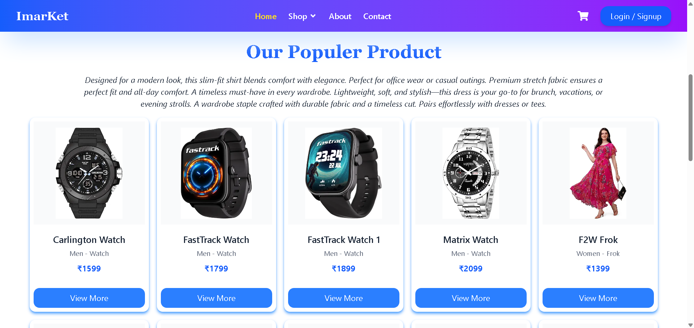
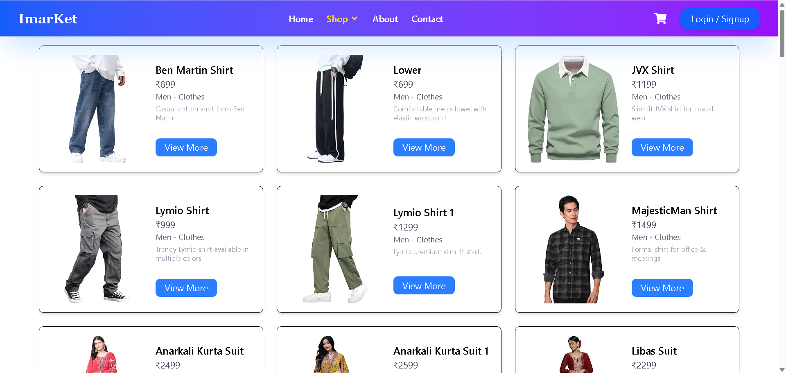
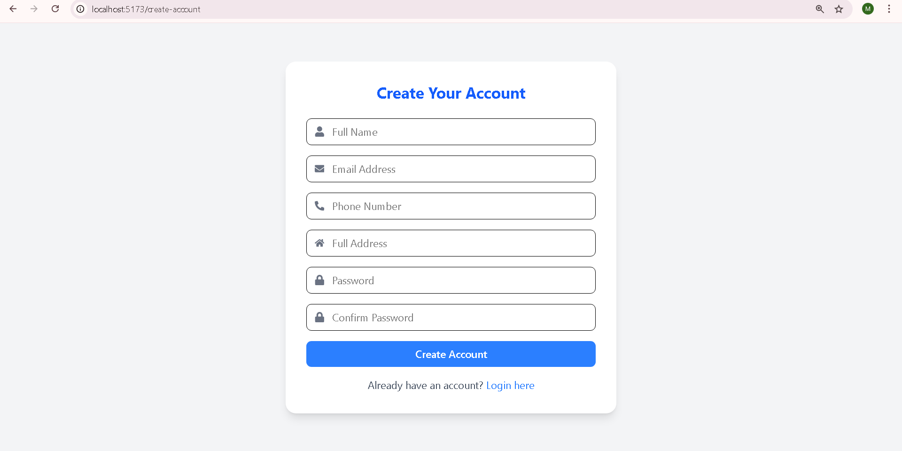

### Welecom in Ecommerce

# Project Overview

This is a full-stack E-Commerce platform designed to provide seamless online shopping experience for both customers and admins. It allows users to show products, add them to cart, place orders, and make secure payments, while admins can manage products, users, and orders from a dedicated admin panel.
but this project is not complete i am also working on it.

# Project URL

## Project images

# Home page

In this page you will see populer product list, and image slider and much more content.

# Product page

Int this page have all products specilly for men and women. These project images are taken from amazon.

I have more images to show my products looks .
some iamges are:

**User Features**:

- Create account & login
- Add products to cart
- See their Profile

 **Cart Features**:
- Add / Remove items
- Increase / Decrease quantity
- View total amount
- Clear entire cart

 **Admin Features**:
  - Admin dashboard
  - Manage products (Add / Edit / Delete)
  - Manage users
  - Manage orders
  - View analytics & sales reports

# Tech Stack

- **Frontend:** React.js, Tailwind CSS
- **Backend:** Node.js, Express.js
- **Database:** MongoDB, Mongoose
- **Authentication:** JWT
- **Email Notifications:** Nodemailer (Gmail SMTP)

# Future Enhancements

- Place orders
- Secure checkout & payments
- View order history
- Add product reviews & ratings
- Wishlist functionality

---------

This project is still evolving, and I’m continuously working to add more exciting features. Stay tuned!

##  Contact

If you face any problem in running or viewing this project, feel free to contact me:

- **Name:** [(Mayank Sharma)]  
- **Email:** [mayank.sharma.devo6@gmail.com]  
- **LinkedIn:** [(https://www.linkedin.com/in/mayank-sharma-991b17369/)]